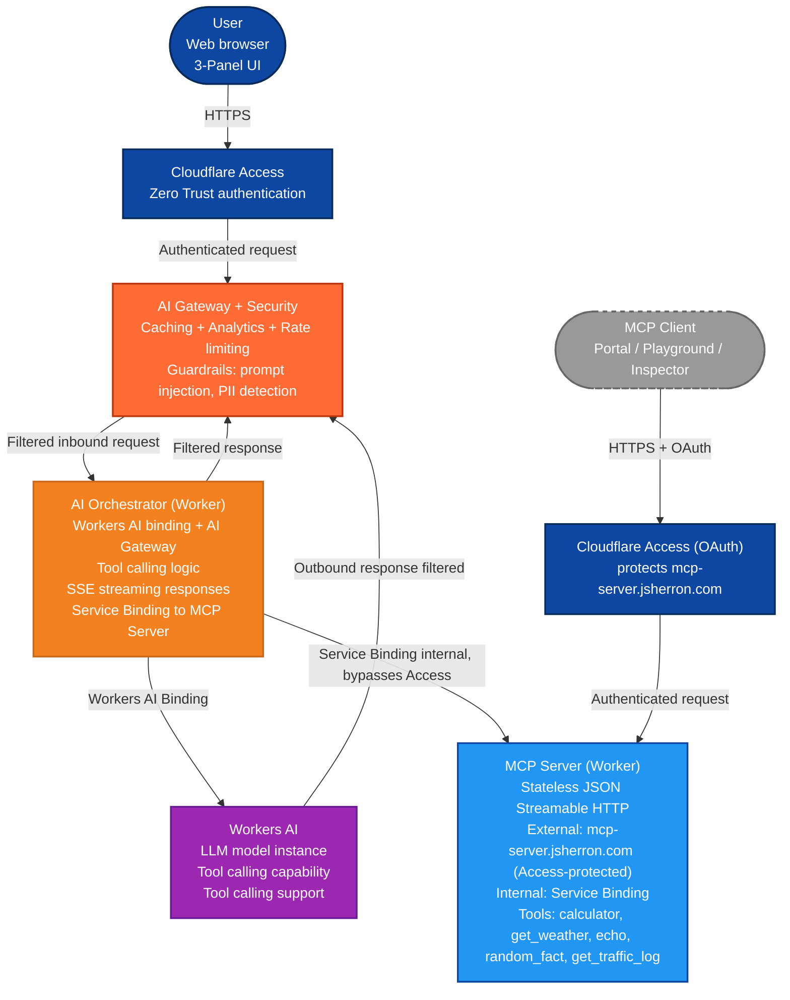

# Architecture

## Overview

This document describes the high-level architecture for the MCP demo running on Cloudflare Workers and the rationale behind the key design choices. The goal is to demonstrate safe, low-latency model orchestration on the edge while keeping the tool execution path internal and auditable.

## Components and why they were chosen

- **User (Browser)** — interactive 3-panel UI that shows prompt input, MCP status, and streaming AI responses.
  - Why: a simple, focused UI makes streaming, tool calls, and internal logs visible for demos and debugging.

- **Cloudflare Access (Zero Trust)** — authenticates users at the edge (SSO, org selectors, device posture), preventing unauthenticated requests from ever reaching the Worker.
  - Why: offloading identity and access policy to Cloudflare reduces in-worker complexity, centralizes policy, and provides enterprise-grade auth without embedding auth logic in demo workers.

- **AI Orchestrator (Worker)** — serves the web UI, orchestrates calls to `Workers AI` and the `AI Gateway`, makes tool-selection decisions, and streams responses via SSE.
  - Why: keeps orchestration, UI, and tool-calling logic colocated for transparency, and allows easy inspection of requests and internal logs.

- **Workers AI** — the model runtime accessed via the Workers AI binding.
  - Why: platform binding avoids extra HTTP hops, reduces latency and cost, and integrates with Cloudflare's model governance and billing.

- **AI Gateway** — sits inline between Cloudflare Access and the model/orchestrator path for caching, analytics, rate limiting, and security guardrails (prompt-injection detection, PII blocking).
  - Why: consolidates caching and safety policies so both inbound requests and outbound model responses are filtered before they reach the worker or the model.

- **MCP Server (Worker)** — implements the MCP protocol (stateless JSON Streamable HTTP) and exposes demo tools. Two access paths: internally via Service Binding from the orchestrator, and externally at `mcp-server.jsherron.com` behind a Cloudflare Access OAuth app. `workers_dev = false` and the `mcp.jsherron.com` alias was removed, so there is no unauthenticated route.
  - Why: the Service Binding path keeps orchestrator→tool calls fast and internal; the Access-protected external path lets real MCP clients (Portal/Playground) connect with enforced authentication.

- **Service Binding** — internal binding used by the orchestrator to call the MCP server. Bypasses Access by design (internal, trusted).
  - Why: Cloudflare prevents worker-to-worker HTTP calls between `*.workers.dev` domains (error 1042). Service Bindings are the supported, lower-latency, secure way to call internal worker code.

- **MCP Client** *(external)* — Cloudflare MCP Portal, Workers AI Playground, MCP Inspector, or any remote MCP client. Connects over HTTPS to `mcp-server.jsherron.com`, completing the Cloudflare Access OAuth flow before reaching the Worker.
  - Why: demonstrates authenticated external consumption of the MCP server, separate from the internal orchestrator path.

## Security and operational considerations

- Centralize authentication and access policy in Cloudflare Access rather than in-app. This removes session storage, cookie handling, and user-management code from the workers. Both public hostnames have their own Access app (web app: One-time PIN; MCP server: OAuth).
- Use the AI Gateway to detect and block prompt injection and to scrub or redact PII before it reaches models or logs.
- Minimize the MCP server's unauthenticated surface: `workers_dev = false`, single Access-protected custom domain, no alias hostnames. Auth is enforced at the Cloudflare edge (the Worker itself does not re-validate the `Cf-Access-Jwt-Assertion` header — see TODO.md for the optional defense-in-depth follow-up).

## Deployment tips

- In `packages/ai-orchestrator/wrangler.toml`, configure the Workers AI binding and the AI Gateway integration.
- In `packages/mcp-server/wrangler.toml`, keep `workers_dev = false` and a single Access-protected custom domain; configure the service binding on the orchestrator side. Protect the external hostname with a Cloudflare Access app (AI controls "MCP server", OAuth).

## Viewing and editing this diagram

- Open this file in VS Code and use Markdown preview (Cmd+Shift+V / Ctrl+Shift+V) or paste the Mermaid block into https://mermaid.live/ to render.

## Summary (TL;DR)

- Simplicity: let Cloudflare handle auth and safety so the workers can focus on orchestration and demo logic.
- Security: Cloudflare Access on both hostnames + no unauthenticated bypass routes + AI Gateway guardrails minimize risk and data exposure.
- Performance: Workers AI binding and Service Bindings remove extra network hops and reduce latency.

If you'd like, I can append example `wrangler.toml` snippets and a short checklist for deploying the orchestrator + private MCP server.
